# SillyPutty.exe

**We are given a file named putty.exe that appers to be a legitimate application**

- First of all we will compute the file hash to identify whether the file is malicious or not through VirusTotal.

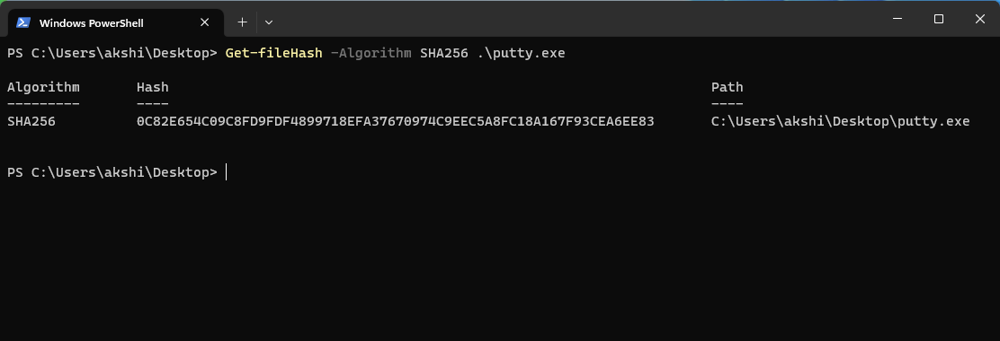

Thus the SHA256 hash of the given file comes out to be :

**SHA256 -> 0C82E654C09C8FD9FDF4899718EFA37670974C9EEC5A8FC18A167F93CEA6EE83**

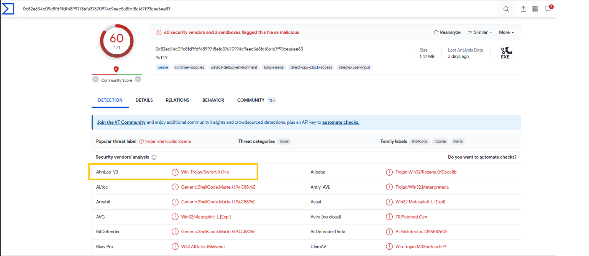

- On VirusTotal , we see that it is a malware , especially a Trojan virus.

- Thus we will now first Statically analyse the file.

## Static Analysis

In static analysis we will first of all see or compute the strings of the file in the powershell using Floss , that will give us all the strings in a systematic form:

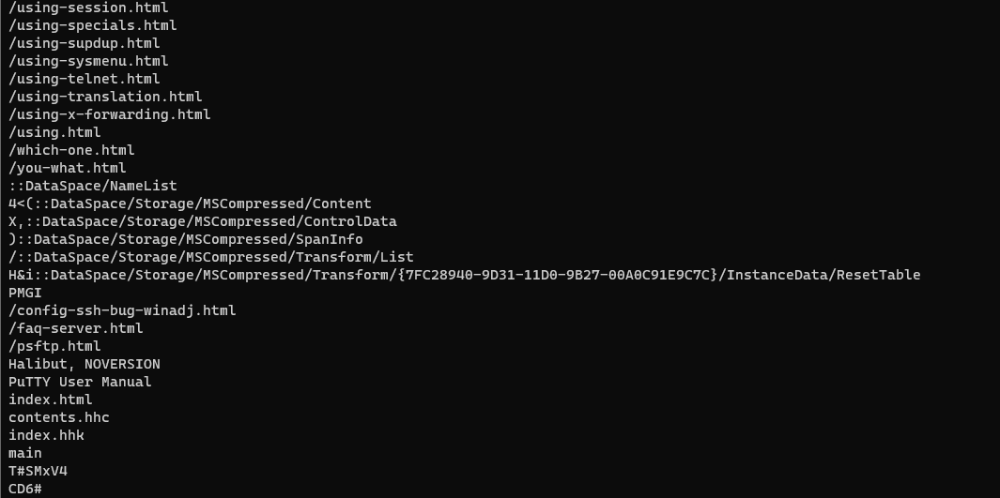

- Here we can see a lot of strings are in the given executable that are in a random order but due to Floss it is slightly classified:

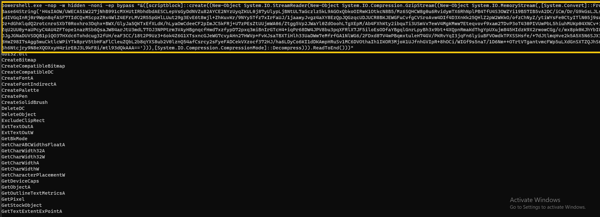

- Here we observe a suspicious string amidst of all the functions and APIs it is using , but as nothing further can be inferred : **We will store this string in our notepad and proceed to further analysis.**

- Now we will move to ProcessMonitor analysis to see the functions and imports or exports APIs it is using->

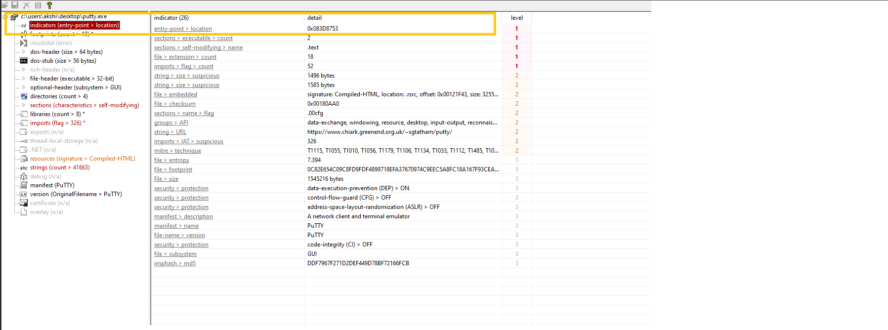

- In the Process Monitor, we can easily see that the Entry Point address of the DLL is **0x083D8753**

As we have got the entry point address of the executable, we have now completed the static analysis of the malware. 

## Dynamic Analysis

So after taking a snapshot of the Sandbox Environment Machine we are using for Malware Analysis, the malware is fired up to see the actual activity it does ->

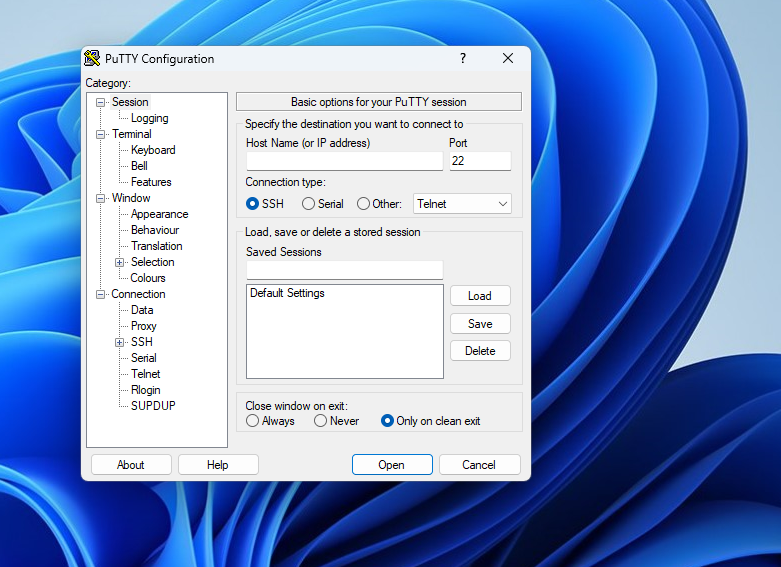

- A dialog box asking for an IP address and port depicting if it wants to establish a connection between the localhost and the port and server provided.

- I filled random IP address and Port inside the dialog box : **127.0.0.1** and **8000** and proceed with the program: 

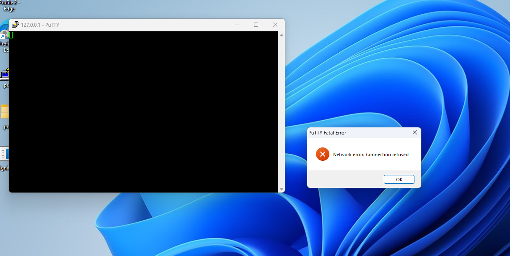

- The application always shows the Network error irrespective of the connection establishment.
 
- **Also I observed that when the application is run then the powershell opens for a fraction of second that i could'nt capture unfortunately**

**This is highly suspicious as it appears that our application is trying to run a program on the background**

### TaskManager

- This tells us that an unknown SSH service is being run by the malware on its own.

### ProcMon Analysis

We will use ProcMon to track the activities on the background the application is running ->

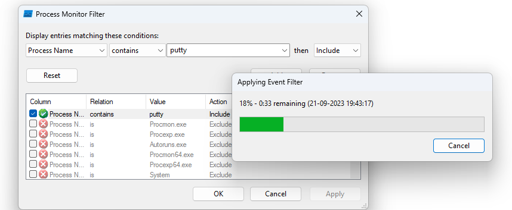

- I filtered the (Process Name)(containing)(putty) and got this ->

- Through this we got the Parent PID of the process running on the background due to action of our malware.

**Parent PID (on my system) -> 4940**

**Process PID(on my system) -> 8008**

- Thus if we want to see the programs run by the malware on itself then that program will have the Process PID as Parent PID.

- And we got a malicious process that is odd one out from all other normal processes.

- I opened this process details and saw that it is only the process that is running the powershell on the background but probably disables its box appearance.

- I got this in the process and started analysing it in the sublime text editor.

- The function was probably decoding the Base64 string given in it here in the marked function.

- I decrypted the Base64 string and stored it in the format of a file 

- The file resulted in a gzip format file that i decompressed to extract the files inside it.

- Here inside the **mal.gz** zip file I got a VB Script :

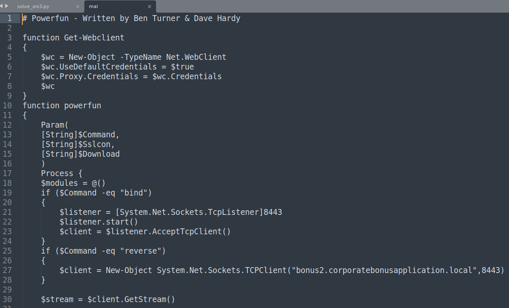

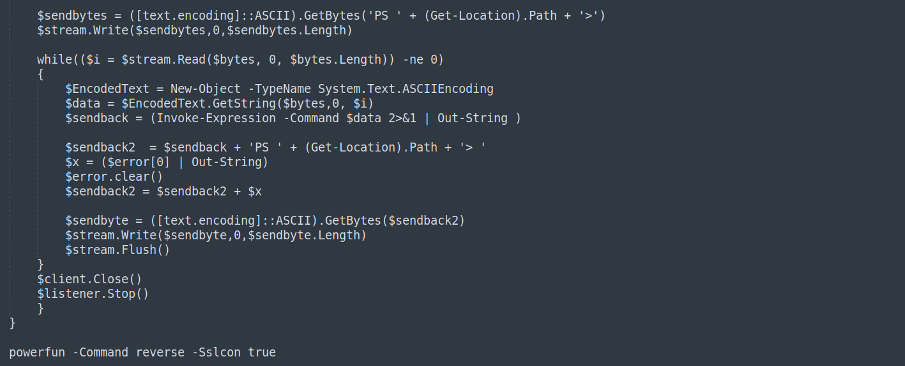

-Here we see that the malware is trying to access the port : **8443** using TCP listening ports.

- Rest of the script was irrelevant as we got the gist of the malicious code.

**Now we will try to capture the packets sent by the malware on the port: 8443**

- Here most of the DNS queries are made by the normal applications but the highlighted DNS query is odd one out and so we can infer that the application tries to make contact with:

- Now we will use Fakenet to see what requests is the malware trying to make at this server on the port 8443

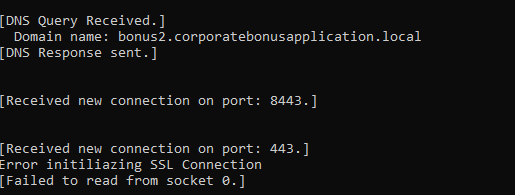

- Thus the Fakenet tool is sending the fake responses to the application and the application is trying to make connection to the server using TCP port .

## THUS WE CAN CONCLUDE THAT:

### 1-> The malware is a <U>REMOTE ACCESS TROJAN</U>

### 2-> SHA256 hash is <u>0C82E654C09C8FD9FDF4899718EFA37670974C9EEC5A8FC18A167F93CEA6EE83</u>

### 3-> ENTRY POINT: DLL entry at <u>0x083D8753</u>

### 4-> Malicious Activity : Runs a powershell on the background to run malicious commands and make connection to the 
### server -> <u>bonus2.corporatebonusapplication.local</u>
### port -> 8443(TCP)

### It tries to give a reverse shell to the hacker who is running the server mentioned.

